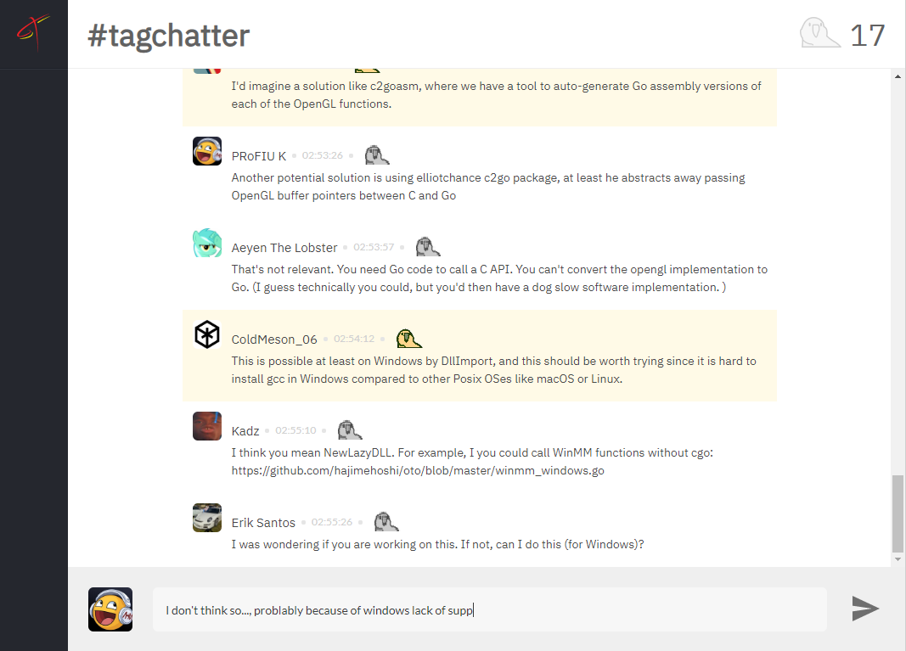

# TagChatter

#### Setup instructions

  
MacOS

    git clone https://github.com/fernando-msj/TagChatter-fontend.git
    cd TagChatter-fontend
    npm install
    open ./index.html
    npm start
    echo done

Ubuntu

    git clone https://github.com/fernando-msj/TagChatter-fontend.git
    cd TagChatter-fontend
    npm install
    gnome-open index.html
    npm start
    echo done

You will probably need to go open the index.html by hand if this open an text editor...

Windows

    git clone https://github.com/fernando-msj/TagChatter-fontend.git
    cd TagChatter-fontend
    npm install
    index.html
    npm start
    echo done

...

* Set your user name
* Set your avatar url (like `https://avatars3.githubusercontent.com/u/9648865?s=460&v=4`)

And you should be now logged in.

Now you can open like 3 more tabs and... you know, talk to yourself...

#### Features
* You can press up and down to resend old messages.
* The parrot count is stored on the server (so, no bugs or unsync between peers).
* Works in multiple tabs.
* It actually scrolls downs when receiving new messages.
* **It sends the message when you press enter!**
* And don't send if you press enter+shift (but won't add an line break-either...).

#### Main differences
* The parrot count and messages are in an single endpoint.
* You need to setup avatar and user name.

#### Current Problems
* The comment list is re-rendered setting `innerHTML` wich causes an flash (*and performance degradation...*).
* There is no error handling (the `.catch` wasn't working for some reason...)
* There is no fake people to talk with (TODO: integrate with webservice or package for generating random avatars and comments).
* All code is in global scope (but this is an toy implementation, so i won't bother to fix it).
